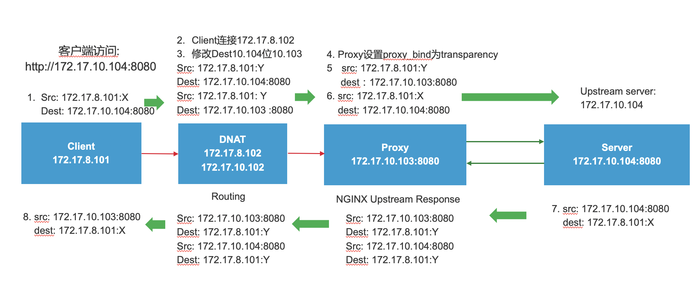
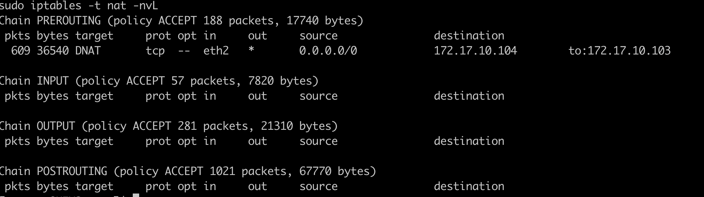
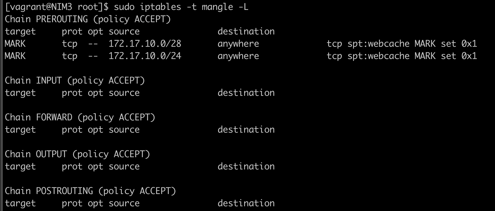

# 通过DNAT在NGINX中使用Transparency IP传输
## 需求说明
>当用户通过客户端请求某个真实业务系统的时候，通常情况下都会暴露一个公网地址，通过负载均衡和反向代理将公网地址转化为内网地址进行访问，因此客户端请求的并不是业务系统的真实域名/IP。当在内网环境里，如果有业务需要在客户端直接访问业务系统的真实域名/IP时，并且在经过多层代理时，需要将客户端的真实IP传递给后端的业务系统，这时可以借助DNAT和NGINX的Transparency IP的机制来解决这一问题（当然也可以使用xff机制）。
- IP Transparency可确保上游服务器观察到每个连接都源自发起该连接的远程客户端，此种方式适用于TCP和UDP协议

为了方便说明问题（以我的测试环境为例），请查看如下报文流程图：
### 报文流程图

### 测试环境说明
为模拟内网环境，我们准备了4台VM，分别部署在两个不同网段，用来模拟路由转发场景，其中client VM（172.17.8.101）和DNAT VM在同一个网段（172.17.8.0/24）；Proxy VM和Server VM在同一个网段（172.17.10.0/24）；具体信息如下表所示：
| VM     | IP Address                 |
| ------ | -------------------------- |
| client | 172.17.8.101               |
| DNAT   | 172.17.8.102 172.17.10.102 |
| Proxy  | 172.17.10.103              |
| Server | 172.17.10.104              |

### 数据流描述
1. client端（172.17.8.101）发起http请求（ http://172.17.10.104:8080 ），并在客户端配置静态路由到DNAT VM(172.17.8.102)。
2. 在DNAT VM上配置DNAT，将路由的目标地址Server VM(172.17.10.104)修改为Proxy VM(172.17.10.103)，所有从client端来的请求，将会路由转发到Proxy VM。
3. 在Proxy VM中设置proxy_bind为transparent,并将客户端请求反向代理到Server(172.17.10.104)。
4. Server VM中处理完请求后，返回response至Proxy VM。
5. Proxy VM将response返回给DNAT VM。
6. DNAT VM将response返回给Client。

## 配置流程
### Client端
客户端需要将默认出口网关修改为NDAT服务器。
```config
sudo route del default gw 10.0.2.2
sudo route add default gw 172.17.8.102
```
### DNAT端
DNAT端需要配置目标地址转换：
```config
sudo sysctl -w net.ipv4.ip_forward=1
sudo iptables -t nat -A PREROUTING -i eth2 -d 172.17.10.103 -p tcp -j DNAT --to-destination 172.17.10.104
```
验证DNAT生效的命令为：
```shell
sudo iptables -t nat -nvL
```

### Proxy端
#### 反向代理配置
在NGINX中配置反向代理设置，因为考虑transparency IP，需要设置user为root,另外配置proxy_bind指令，具体配置为：
```config
server {
    listen 172.17.10.103:8080;
    location / {
        proxy_bind $remote_addr transparent;
        proxy_pass http://http_upstreams;
    }
}

upstream http_upstreams {
    server 172.17.10.104:8080;
}
```
#### iptables设置
```shell
sudo ip rule add fwmark 1 lookup 100
sudo ip route add local 0.0.0.0/0 dev lo table 100
iptables -t mangle -A PREROUTING -p tcp -s 172.17.10.0/24 --sport 8080 -j MARK --set-xmark 0x1/0xffffffff
```
验证配置：

### Server端
在Server端NGINX配置测试响应：
```config
server {
    listen 8080;

    location / {
        return 200 "Hello from $hostname. You connected from $remote_addr:$remote_port to $server_addr:$server_port\n";
    }
}
```
配置本地网关指向Proxy端：
```shell
sudo route del default gw 10.0.2.2
sudo route add default gw 172.17.10.103
```

## 结果验证
通过curl命令，可以成功访问应用真实IP获取到响应。

